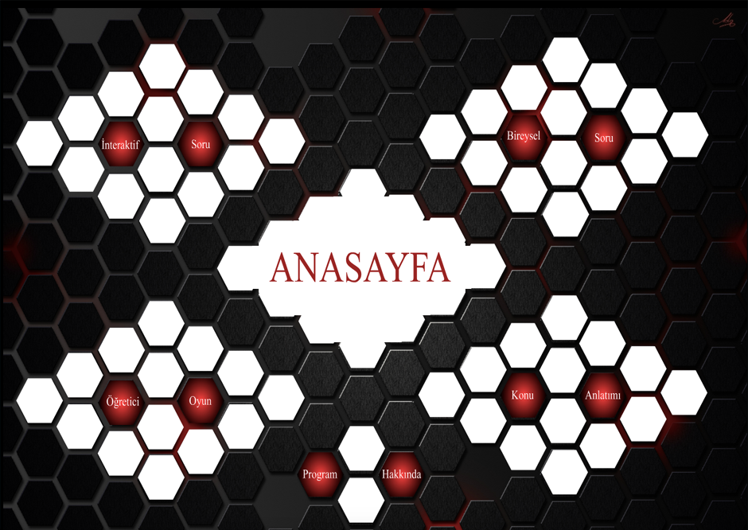

# Yansıma - Dönme - Öteleme İnteraktif Öğretim

####  Geliştirici
- Muhammed Eren DURSUN
- Bilgisayar ve Öğretim Teknolojileri Eğitimi

####  Proje Tanıtım
- Yansıma - Dönme - Öteleme İnteraktif Öğretim
- ActionScript 3.0

####  Projenin Amacı
- Öğretmenin, Yansıma - Dönme - Öteleme konularını öğrencilere daha somut, kolay ve kalıcı bir şekilde öğrencilere öğretmesini amaçlayan tamamen özgün bir projedir.

# Galeri

# Video

Eklenecek...
